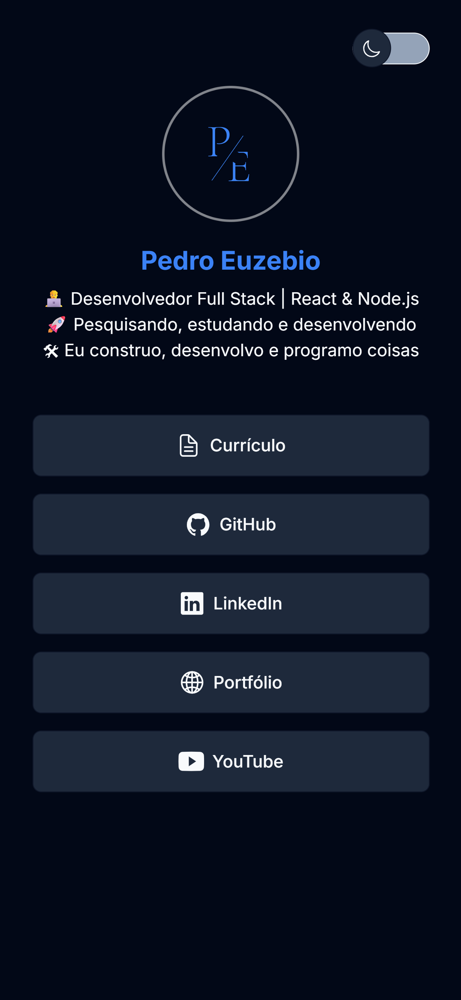
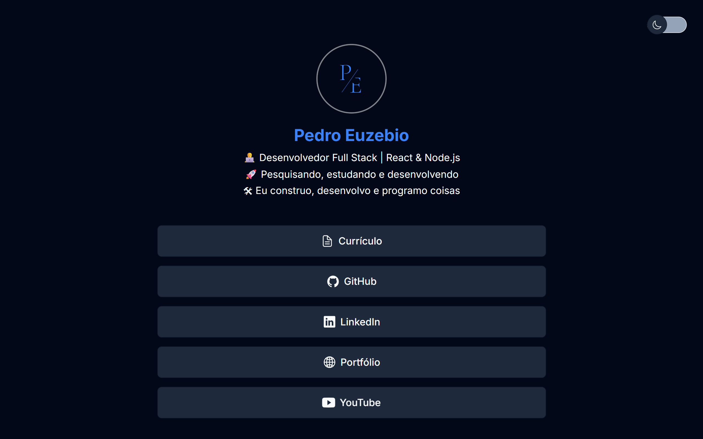

<p align="center">
  

  

  <a href="https://github.com/pedroeuzebiodev/agregador-de-links/commits/master">
    
  </a>

   

   <a href="https://github.com/pedroeuzebiodev/agregador-de-links/stargazers">
    
  </a>

  <a href="https://pedroeuzebiodev.github.io/agregador-de-links">
    
  </a>
</p>

<h1 align="center">
  
</h1>

<h4 align="center">
 🚧  Agregador de Links 🔗 Concluído 🚀 🚧
</h4>

<p align="center">
 <a href="#-sobre-o-projeto">Sobre</a> •
 <a href="#-funcionalidades">Funcionalidades</a> •
 <a href="#-layout">Layout</a> • 
 <a href="#-como-executar-o-projeto">Como executar</a> •
 <a href="#-tecnologias">Tecnologias</a> •
 <a href="#-autor">Autor</a> •
 <a href="#user-content--licença">Licença</a>
</p>

## 💻 Sobre o projeto

🔗 Agregador de links responsivo e com troca de tema como cartão de visitas para meus links.

---

## ⚙️ Funcionalidades

- [x] Usuários podem trocar o tema do cartão de visitas clicando no botão do lado superior a direita:

  - [x] Tema escuro (padrão)
  - [x] Tema claro

---

## 🎨 Layout

### Mobile

<p align="center">
  
</p>

### Web

<p align="center">
  
</p>

---

## 🚀 Como executar o projeto

### Pré-requisitos

Antes de começar, você vai precisar ter instalado em sua máquina a seguinte ferramenta e extensão: [Git](https://git-scm.com) e [Live Server](https://marketplace.visualstudio.com/items?itemName=ritwickdey.LiveServer). Além disto é bom ter um editor para trabalhar com o código como [VSCode](https://code.visualstudio.com/)

#### 🧭 Rodando o projeto

```bash

# Clone este repositório
$ git clone git@github.com:pedroeuzebiodev/agregador-de-links.git

# Acesse a pasta do projeto no seu terminal/cmd
$ cd agregador-de-links

# Abra o arquivo index.html com a extensão Live Server do VS Code

# A aplicação será aberta na porta:5500 - acesse http://127.0.0.1:5500

```

---

## 🛠 Tecnologias

As seguintes ferramentas foram usadas na construção do projeto:

#### **Website**

- **[HTML](https://developer.mozilla.org/pt-BR/docs/Web/HTML)**
- **[CSS](https://developer.mozilla.org/pt-BR/docs/Web/CSS)**
- **[JavaScript](https://developer.mozilla.org/pt-BR/docs/Web/JavaScript)**

#### **Utilitários**

- Editor: **[Visual Studio Code](https://code.visualstudio.com/)** → Extensions: **[Live Server](https://marketplace.visualstudio.com/items?itemName=ritwickdey.LiveServer)**
- Markdown: **[StackEdit](https://stackedit.io/)**, **[Markdown Emoji](https://gist.github.com/rxaviers/7360908)**
- Commit Conventional: **[Commitlint](https://github.com/conventional-changelog/commitlint)**
- Ícones: **[Ionicons](https://ionic.io/ionicons)**
- Fontes: **[Inter](https://fonts.google.com/specimen/Inter)**

---

## 🦸 Autor

<a href="https://www.linkedin.com/in/pedroeuzebio">
  

  <br />

  <sub>
    <b>Pedro Euzebio</b>
  </sub>
</a>

<br>

<a href="mailto:pedroeuzebio.contato@gmail.com" class="contato">
  
</a>

<a href="https://www.linkedin.com/in/pedroeuzebio" class="contato">
  
</a>

---

## 📝 Licença

Este projeto esta sobe a licença [MIT](./LICENSE).

Feito com ❤️ por Pedro Euzebio 👋 [Entre em contato!](https://www.linkedin.com/in/pedroeuzebio)
